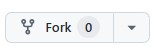

# Installatie van de TOS-Teachbot Software


Voor dat je begint dien je een clone van de `my_ur_ROS2` repository te maken.


Voor dat je begint dien je een clone van de `my_ur_ROS2` repository te maken.


## Cloning de TOS-Teachbot software
Voor het maken van de TOS-Teachbot software template maak je gebruik van een Github clone die is voorbereid. Je kunt er voor kiezen om deze clone onder een eigen account van Github te plaatsen (1e keuze hieronder). Je kunt daarna eenvoudig backup's van je werk maken naar je eigen Github account.

> we maken gebruik van een prefix my_ur in de packages van de repository om onderscheid te maken met de standaard Universal Robots packages.

:::::{card} 

::::{tab-set}

:::{tab-item} Met GIT-repository support

* Maak een account aan bij [Github](https://github.com/) en login op dit account

* Open de [my_ur_ROS2](https://github.com/AvansMechatronica/my_ur_ROS2) repository

* Maak een Fork van de repository naar je eigen Github account door op het **Fork icoon**  te klikken:



* Volg de instructies, maar wijzig de naam van de nieuwe repository niet. Bevestig met **Create Fork**  

* Nu kun je de workspace als volgt creëren

```bash
mkdir -p ~/my_ur_ws/src
cd ~/my_ur_ws/src
git clone https://github.com/<jouw_account_naam>/my_ur_ROS2.git
```

*ps. Het gebruik van github (zoals add, commit & push commando's) valt  buiten de scope van deze documentatie*

:::

:::{tab-item} Zonder GIT-repository support

* Je kunt de workspace als volgt creëren
```bash
mkdir -p ~/my_ur_ws/src
cd ~/my_ur_ws/src
git clone https://github.com/AvansMechatronica/my_ur_ROS2.git
```

:::

::::

:::::


## Installatie van Universal Robot support packages

```bash
cd ~/my_ur_ws/src/my_ur_ROS2/install
./install
```

## Bouwen van de workspace
> Dit is al gebeurd in de installatie. Wijzig je iets in de workspace dan kun je als volgt bouwen
```bash
# Build the workspace
cd ~/my_ur_ws
colcon build --symlink-install
source install/setup.bash

```